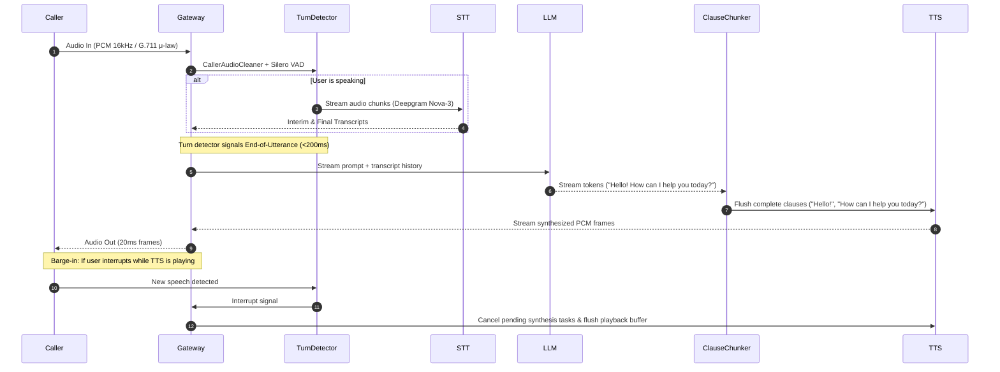

# Claude System Guide: PersonaPlex Orchestration AI & Modular Provider Stack

> **Comprehensive Technical Specification & Architecture Roadmap**  
> For the low-level PersonaPlex 7B hardware manual, see [PROJECT_DETAILS.md](file:///c:/Users/kisho/Desktop/orchestration_ai/PROJECT_DETAILS.md).

---

## 1. Executive Summary & Dual-Engine Architecture

This repository is transitioning into a **Dual-Engine Voice Agent Platform**:

1. **Engine A: Native PersonaPlex Speech-to-Speech (S2S)**
   * Full-duplex end-to-end neural audio model (Kyutai Moshi / Mimi codec at 24 kHz).
   * Runs locally on NVIDIA GPU (~18–20 GB VRAM) or through the loopback mock worker (`ws://127.0.0.1:8998`).
   * English-only, zero-shot 18-voice persona presets, ultra-low-latency conversational audio tokens.

2. **Engine B: Modular Cascaded Cloud Provider Stack (STT + LLM + TTS + Telephony)**
   * Flexible, API-key powered voice agent stack (similar to Vapi / Retell AI / Bland AI).
   * Decouples the conversational pipeline into pluggable external cloud services:
     * **Speech-to-Text (STT):** Deepgram Nova-3, Groq Whisper, OpenAI Whisper.
     * **Language Model (LLM):** OpenAI (GPT-4o / GPT-4o-mini), Anthropic (Claude 3.5 Haiku / Sonnet), Groq (Llama 3.3), Neon AI Gateway.
     * **Text-to-Speech (TTS):** Cartesia Sonic, ElevenLabs, Deepgram Aura, OpenAI TTS.
     * **Telephony:** Twilio, LiveKit, Telnyx.
   * Inherits the repository's production audio foundation: Silero VAD v6, <200ms barge-in interruption detection, streaming clause chunker, and ITU-T G.711 μ-law / PCM16 resamplers.

---

## 2. Directory Structure & Key Components

```
orchestration_ai/
├── orchestration/
│   ├── audio/                      # DSP & Telephony Audio Processing
│   │   ├── cleaner.py              # 80Hz HPF + RNNoise neural denoise + Silero VAD
│   │   ├── codecs.py               # Bit-exact G.711 μ-law (8kHz) encoder/decoder
│   │   ├── resample.py             # libsoxr high-fidelity anti-aliased resampler
│   │   ├── turn_detector.py        # Hysteresis + barge-in detector (<200ms cutoff)
│   │   └── dsp.py                  # Soft-clipping, RMS meter, format conversions
│   ├── chunker/
│   │   └── bridge.py               # ClauseChunker: Splits streaming LLM tokens into TTS clauses
│   ├── providers/                  # [NEW] Modular Provider Abstraction Layer
│   │   ├── base.py                 # Abstract Base Classes (BaseSTT, BaseLLM, BaseTTS, BaseTelephony)
│   │   ├── registry.py             # Provider Registry & Factory
│   │   ├── stt/                    # Deepgram, Groq, Whisper adapters
│   │   ├── llm/                    # OpenAI, Anthropic, Groq, OpenRouter adapters
│   │   ├── tts/                    # Cartesia, ElevenLabs, Deepgram Aura adapters
│   │   └── telephony/              # Twilio Media Streams, LiveKit SIP adapters
│   ├── worker/
│   │   ├── pool.py                 # Multi-worker process clustering
│   │   ├── mock_worker.py          # Zero-GPU loopback simulation worker (port 8998)
│   │   ├── cascaded_worker.py      # Cascaded pipeline worker wrapper
│   │   └── cloud_cascaded_worker.py# [NEW] Cloud-provider streaming orchestrator
│   ├── dormant/
│   │   └── worker/
│   │       └── local_cascade.py    # Reference cascaded pipeline (VAD -> STT -> LLM -> TTS)
│   ├── db/
│   │   ├── models.py               # Agent, Version, ProviderKey, CallSession schemas
│   │   ├── session.py              # SQLite / Neon PostgreSQL async engine
│   │   └── agent_service.py        # Version-controlled agent CRUD
│   ├── gateway/
│   │   ├── app.py                  # FastAPI server, REST & WebSocket routes
│   │   ├── routes_providers.py     # [NEW] REST API for provider keys and catalog
│   │   └── lean_studio_ui.py       # React 18 frontend HTML/JS embed
│   ├── protocol/
│   │   ├── audio.py                # Audio constants (16kHz Client, 8kHz Telephony, 24kHz Native)
│   │   └── messages.py             # WebSocket binary & JSON framing
│   └── pipeline/
│       └── end_detector.py         # End-of-call detector (regex, silence timeout)
├── frontend/                       # Vite + React 18 Developer Console & Studio
│   └── src/
│       ├── components/
│       │   └── Providers/          # [NEW] Provider settings, keys, voice catalog UI
│       └── App.tsx
├── scripts/
│   └── run.ps1                     # Dev server, mock worker, and test runner
└── tests/                          # Pytest suite
```

---

## 3. Modular Provider Architecture Specification

### 3.1 Provider Data Model (`orchestration/db/models.py`)
To store API keys and user provider selections securely:

```python
class ProviderType(str, enum.Enum):
    STT = "stt"
    LLM = "llm"
    TTS = "tts"
    TELEPHONY = "telephony"

class ProviderKeyRecord(Base):
    __tablename__ = "provider_keys"

    id = Column(String, primary_key=True)               # e.g., "prov_xyz"
    provider_type = Column(String, nullable=False)       # "stt", "llm", "tts", "telephony"
    provider_name = Column(String, nullable=False)       # "deepgram", "openai", "cartesia", "twilio"
    api_key_encrypted = Column(Text, nullable=False)     # AES-GCM encrypted or masked
    config_json = Column(Text, default="{}")             # Default model, voice, temperature
    is_active = Column(Boolean, default=True)
    created_at = Column(DateTime, default=datetime.utcnow)
```

### 3.2 Abstract Provider Interfaces (`orchestration/providers/base.py`)

#### A. Speech-to-Text (`BaseSTTProvider`)
* **Role:** Streams raw PCM audio (16 kHz / 8 kHz) and yields finalized and interim transcriptions.
* **Method:** `async def transcribe_stream(self, audio_chunk_iter: AsyncIterator[bytes]) -> AsyncIterator[TranscriptionEvent]`
* **Implementations:**
  * `DeepgramSTT`: Live WebSocket (`wss://api.deepgram.com/v1/listen?model=nova-3&encoding=linear16&sample_rate=16000`).
  * `GroqWhisper`: Fast REST audio chunk endpoint (`distil-whisper-large-v3-en`).

#### B. Language Model (`BaseLLMProvider`)
* **Role:** Receives chat message history and streams tokens incrementally.
* **Method:** `async def chat_stream(self, messages: list[dict], system_prompt: str, tools: list[dict] = None) -> AsyncIterator[str]`
* **Implementations:**
  * `OpenAILLM`: `gpt-4o-mini`, `gpt-4o` with streaming delta tokens.
  * `AnthropicLLM`: `claude-3-5-haiku`, `claude-3-5-sonnet` via Messages API SSE stream.
  * `GroqLLM`: `llama-3.3-70b-versatile` (<250ms time-to-first-token).

#### C. Text-to-Speech (`BaseTTSProvider`)
* **Role:** Takes text clauses generated by the `ClauseChunker` and streams raw PCM audio.
* **Method:** `async def synthesize_stream(self, text_clause: str, voice_id: str) -> AsyncIterator[bytes]`
* **Implementations:**
  * `CartesiaTTS`: WebSocket low-latency Sonic API (~90ms TTFB, 24kHz or 16kHz PCM).
  * `ElevenLabsTTS`: ElevenLabs WebSocket streaming (`eleven_turbo_v2_5`).
  * `DeepgramAuraTTS`: Low-latency conversational TTS.

#### D. Telephony Gateway (`BaseTelephonyProvider`)
* **Role:** Manages SIP/PSTN call signaling and bi-directional audio streaming.
* **Implementations:**
  * `TwilioTelephony`: Bidirectional WebSocket (`Twilio Media Streams`) converting 8 kHz μ-law frames.

---

## 4. Cascaded Execution Loop & Turn Management

The cloud worker (`cloud_cascaded_worker.py`) implements this non-blocking execution cycle:



### Key Performance Targets:
* **Turn Detection Latency:** ≤ 180 ms (Silero VAD + linguistic continuation check).
* **LLM Time-to-First-Token (TTFT):** ≤ 220 ms (Groq / GPT-4o-mini).
* **TTS Time-to-First-Byte (TTFB):** ≤ 100 ms (Cartesia Sonic).
* **Total Conversational Latency:** **< 500 ms** end-to-end.

---

## 5. Agent Model Dual-Mode Integration

In `orchestration/db/models.py`, update `AgentRecord` to support engine selection:

```python
# Engine mode options
ENGINE_PERSONAPLEX = "personaplex_s2s"  # Native GPU 24kHz model
ENGINE_CASCADED    = "cascaded_cloud"   # STT + LLM + TTS stack

# Fields added to AgentRecord / AgentVersionRecord:
# engine_type: str = "cascaded_cloud"
# stt_provider_id: str = "deepgram"
# llm_provider_id: str = "openai"
# llm_model: str = "gpt-4o-mini"
# tts_provider_id: str = "cartesia"
# tts_voice_id: str = "sonic-english-natural"
```

---

## 6. How to Run & Validate

### Local Development Environment
The virtual environment `.venv-gpu` contains all base dependencies:
```powershell
# 1. Start the platform in dev mode (FastAPI + React Studio + Mock Worker)
.\scripts\run.ps1 dev

# 2. Run the test suite
.\scripts\run.ps1 test
```

### Running the Cascaded Pipeline Standalone
To test the cascaded loop offline:
```powershell
.venv-gpu\Scripts\python.exe -m pytest tests/test_cascaded_pipeline.py -v
```

---

## 7. Implementation Roadmap & Next Steps

When instructing an LLM or implementing the next phase, execute in this order:

1. **Step 1: Provider Interfaces & Registry**
   * Create `orchestration/providers/base.py` and `orchestration/providers/registry.py`.
   * Implement `DeepgramSTT`, `OpenAILLM`, and `CartesiaTTS` adapters with clean async interfaces.

2. **Step 2: Cloud Cascaded Worker**
   * Adapt [`orchestration/dormant/worker/local_cascade.py`](file:///c:/Users/kisho/Desktop/orchestration_ai/orchestration/dormant/worker/local_cascade.py) into `orchestration/worker/cloud_cascaded_worker.py` utilizing the provider registry instead of local Ollama/Whisper.

3. **Step 3: Database & API Key Management**
   * Add `ProviderKeyRecord` to `orchestration/db/models.py`.
   * Add CRUD routes `/v1/providers` to store and test API keys.

4. **Step 4: Studio UI Providers View**
   * Implement the "Providers" tab in `frontend/src/` (STT, LLM, TTS, Telephony cards matching the UI screenshot).
   * Allow users to input API keys, select active providers, and test voice output directly from the browser.
