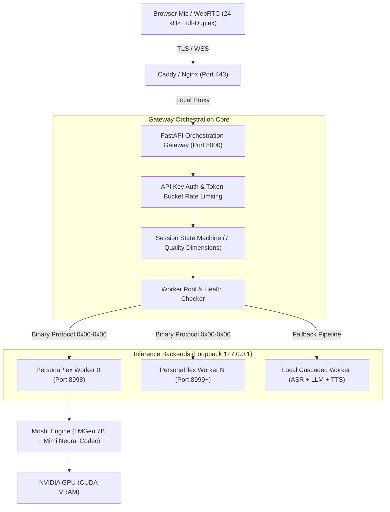

# PersonaPlex Orchestration AI

A production-grade, full-duplex conversational orchestration layer designed for **NVIDIA PersonaPlex 7B** (Moshi architecture, Mimi neural codec: 24 kHz mono, 12.5 Hz, 1,920 samples/frame) and local fallback pipelines. Delivers low-latency, interruption-friendly voice conversation with system-prompt persona conditioning, 18 male and female voice presets, consent-gated zero-shot voice cloning, and Linux GPU VM deployment automation.

---

## System Architecture



---

## Verified Facts & Upstream Capabilities

Before configuring or deploying PersonaPlex, review the ground truth established directly from the upstream repository (`github.com/NVIDIA/personaplex`):

| Dimension | Upstream Implementation | Verified Capability & Limitation |
| :--- | :--- | :--- |
| **Language Support** | Fisher English Corpus (`LDC2004T19`) + English dialogs | **English Only**. PersonaPlex has zero native Indic or multilingual training. Non-English speech produces garbled hallucinations. For Indian English/Indic accents, use the built-in local cascaded fallback pipeline. |
| **System Prompt** | `<system> {prompt} <system>` | Exact delimiters (both tags are `<system>`, NOT `</system>`). Stepped autoregressively one token per 80ms frame. Keep under 350 tokens (<7s delay) during connection initialization. |
| **Voice Conditioning** | `.pt` pre-extracted embeddings or `.wav` reference | 24 kHz mono audio normalized to -24 LUFS. Recommended length: 5–12 seconds (~8–10s optimal = ~2s handshake overhead). Audio > 30s causes connection timeouts. |
| **Concurrency Lock** | `moshi.server` `async with self.lock:` | **Strictly 1 active audio stream per worker process**. Serving $N$ concurrent streams requires running $N$ independent worker processes on separate loopback ports (`8998`, `8999`, etc.). |
| **Memory Footprint** | PyTorch FP16 / BF16 weights | ~16–20 GB VRAM per 7B worker process. A 24 GB GPU (RTX 3090/4090, A10G) reliably hosts **1 worker process**. A 48 GB GPU (A40, L40) hosts 2 processes. An 80 GB GPU (A100, H100) hosts 3–4 processes. |

---

## 7 Conversation Quality Dimensions

The orchestration layer continuously instruments and enforces 7 core conversation quality dimensions:

1. **Listening:** Full-duplex 24 kHz PCM capture, Silero VAD energy detection, bit-exact 1,920-sample chunking with zero dropped frames.
2. **Understanding:** Real-time transcript tracking via text frame `0x02` and session transcript export (`/v1/sessions/{id}/transcript`).
3. **Reasoning:** Behavior conditioned via system prompts sanitized and wrapped with `<system>` delimiters.
4. **Speaking:** 24 kHz acoustic delivery, click-free crossfading, consistent loudness, and jitter-buffered packet queueing.
5. **Latency:** Time-To-First-Audio (TTFA) target < 300 ms p50 after user turn completion; frame processing under 80 ms. Telemetry exposed at `/metrics`.
6. **Conversation:** Barge-in interruption handling (<200 ms playback cutoff on user speech), natural backchannel tolerance, and turn-taking state machine.
7. **Task Success:** Per-session outcome tagging (`in_progress`, `completed`, `interrupted`, `failed`) and end-of-call analytics.

---

## Built-In Persona Registry

Persona configurations live in `orchestration/persona/registry.py` and are accessible via REST API (`/v1/agents`):

| Persona ID | Display Name | Gender | Default Voice | Speaking Style & Character |
| :--- | :--- | :--- | :--- | :--- |
| `support_agent` | Alex | Female | `NATF1.pt` | Helpful, patient, concise customer support with conversational backchannels. |
| `wise_teacher` | Dr. Elena | Female | `NATF2.pt` | Calm, thoughtful mentor using vivid analogies and checking comprehension. |
| `sales_caller` | Marcus | Male | `NATM1.pt` | Upbeat, consultative sales specialist focused on active qualification questions. |
| `casual_friend` | Sam | Male | `NATM0.pt` | Relaxed, natural peer speaking casually with contractions and authentic reactions. |
| `indian_pro` | Aarav | Male | `NATM0.pt` | Articulate Indian English speaker (uses cascaded engine fallback). |
| `indian_priya` | Priya | Female | `NATF0.pt` | Warm, colloquial Indian English speaker (uses cascaded engine fallback). |

### Overriding System Prompts
```bash
curl -X PUT http://127.0.0.1:8000/v1/agents/support_agent \
  -H "Content-Type: application/json" \
  -H "X-API-Key: test-api-key" \
  -d '{
    "id": "support_agent",
    "name": "Alex",
    "system_prompt": "You are Alex, a helpful tier-1 technical support engineer. Speak in short, direct sentences.",
    "voice_ref": "NATF1.pt"
  }'
```

---

## 18 Official Voice Presets

All 18 upstream PersonaPlex presets are indexed and accessible via `GET /v1/voices`:

- **Natural Female (4):** `NATF0.pt` (Warm & Calm), `NATF1.pt` (Crisp & Professional), `NATF2.pt` (Expressive Teacher), `NATF3.pt` (Bright & Articulate)
- **Natural Male (4):** `NATM0.pt` (Deep & Authoritative), `NATM1.pt` (Warm Consultative), `NATM2.pt` (Technical & Energetic), `NATM3.pt` (Casual & Direct)
- **Variety Female (5):** `VARF0.pt` (Storyteller), `VARF1.pt` (Presenter), `VARF2.pt` (Analyst), `VARF3.pt` (Serene), `VARF4.pt` (Actor)
- **Variety Male (5):** `VARM0.pt` (Radio Announcer), `VARM1.pt` (Astronaut), `VARM2.pt` (Empathetic), `VARM3.pt` (Tech Host), `VARM4.pt` (Baritone)

Inspect voice details and preview audio:
```bash
# List all presets and active clones
curl http://127.0.0.1:8000/v1/voices

# Download preview sample
curl http://127.0.0.1:8000/v1/voices/NATF1.pt/preview --output preview.wav
```

---

## Zero-Shot Voice Cloning Pipeline

Upload a 5–12 second voice sample (WAV, MP3, M4A, OGG) to generate conditioning artifacts for PersonaPlex.

### Workflow & Quality Assurance
1. **Audio Decoding & Normalization:** Decodes using `ffmpeg`, resamples to 24 kHz mono, normalizes loudness to -24.0 LUFS, trims silence.
2. **Signal Quality Validation:** Verifies duration (minimum 3s, recommended 5–12s), checks clipping (<5% clipped samples), detects silence (<95% silent frames).
3. **Conditioning Artifact Generation:** Extracts acoustic conditioning tensors (`.pt` or `.npy`) cached to persistent storage.
4. **Speaker Similarity Verification:** Measures speaker-embedding cosine similarity using Resemblyzer or acoustic mel-filterbanks against reference audio. Minimum threshold: `0.65`.
5. **Consent Gate:** Requires explicit `consent=true` parameter in API requests. Unauthorized cloning attempts are rejected with HTTP 400.

### Voice Cloning via REST API
```bash
curl -X POST http://127.0.0.1:8000/v1/voices/clone \
  -H "X-API-Key: test-api-key" \
  -F "audio=@my_sample.wav" \
  -F "voice_name=Rohan" \
  -F "gender=male" \
  -F "consent=true"
```

Response:
```json
{
  "status": "cloned",
  "voice": {
    "id": "clone_a1b2c3d4e5f6",
    "name": "Rohan",
    "gender": "male",
    "speaker_similarity": 0.84,
    "consent_verified": true
  }
}
```

---

## Linux GPU VM Deployment (Krutrim Cloud / Ubuntu)

### 1. Automated VM Provisioning
Run the deployment script on a fresh Ubuntu GPU VM with an NVIDIA GPU (CUDA 12.x):

```bash
chmod +x deploy_krutrim.sh
export HF_TOKEN="your_huggingface_token"
./deploy_krutrim.sh
```

The script will:
- Verify `nvidia-smi` and CUDA driver compatibility.
- Install OS dependencies (`ffmpeg`, `libopus-dev`, `python3-venv`, `build-essential`).
- Point `HF_HOME` and model caches to persistent disk (`/mnt/models`).
- Pre-download PersonaPlex weights from Hugging Face (`nvidia/personaplex-7b`).
- Install systemd service units for Moshi worker processes and the FastAPI gateway.

### 2. Multi-Worker Cluster Management
To launch multiple worker instances on a single large GPU (ports 8998, 8999):

```bash
chmod +x scripts/run_cluster.sh
./scripts/run_cluster.sh --workers 2 --base-port 8998 --gpu 0
```

### 3. Systemd Services
Control background services using `systemctl`:

```bash
# Manage Moshi worker on port 8998
sudo systemctl status personaplex-worker@8998
sudo systemctl restart personaplex-worker@8998

# Manage Orchestration Gateway
sudo systemctl status personaplex-gateway
sudo systemctl restart personaplex-gateway
```

### 4. Reverse Proxy with TLS (Caddy or Nginx)
Browser microphone access (`navigator.mediaDevices.getUserMedia`) requires a secure HTTPS/WSS origin.

Using **Caddy** (automatic Let's Encrypt TLS):
```bash
sudo cp deploy/proxy/Caddyfile /etc/caddy/Caddyfile
# Edit /etc/caddy/Caddyfile with your domain
sudo systemctl reload caddy
```

Using **Nginx**:
```bash
sudo cp deploy/proxy/nginx.conf /etc/nginx/sites-available/personaplex
sudo ln -s /etc/nginx/sites-available/personaplex /etc/nginx/sites-enabled/
sudo nginx -t && sudo systemctl reload nginx
```

---

## Developer Web Console

Open the interactive developer console in any web browser over HTTPS/WSS:
👉 **`https://your-domain.com/console`** (or `http://127.0.0.1:8000/console` locally)

Features:
- **Persona Selector:** One-click switching between Support, Teacher, Sales, Friend, and Indian English personas.
- **Voice Preset Catalog:** Select among all 18 PersonaPlex presets with instant acoustic profile badge updates.
- **Voice Cloning Studio:** Record 8 seconds from the microphone or upload an audio sample with the required consent gate.
- **Live Visualizer Stage:** Apple Intelligence inspired Siri Orb visualizer reacting to audio energy and speech cadence.
- **Real-Time Telemetry:** Live monitoring of TTFA, frame counters, barge-in interruption events, and GPU temperature/utilization.
- **Full-Duplex Transcript:** Turn-by-turn speech bubble tracking with barge-in interruption tags.

---

## Configuration Layer

Set environment variables in `.env` (copied from `.env.example`) or configure `config.yaml`:

```yaml
server:
  host: "0.0.0.0"
  port: 8000
  api_key: ""              # Set for production authentication
  rate_limit_rpm: 60       # Token bucket rate limiting

worker:
  type: "personaplex"      # "personaplex" or "local_cascade"
  hosts:
    - "127.0.0.1:8998"
  model_dir: "/mnt/models/personaplex"

audio:
  sample_rate: 24000
  frame_size: 1920
  target_lufs: -24.0

persona:
  default_id: "support_agent"
  max_system_prompt_tokens: 350
```

---

## Testing

Run the automated test suite (75 test cases covering wire protocol, session lifecycle, barge-in, voice cloning, audio similarity, rate limiting, and security):

```bash
# Run unit & integration test suite (CPU/Mock mode)
pytest -v

# Run real-GPU test on an NVIDIA GPU node
pytest -v -m gpu
```

---

## License

Apache 2.0. Upstream PersonaPlex model weights are subject to the [NVIDIA PersonaPlex Model License](https://huggingface.co/nvidia/personaplex-7b).
