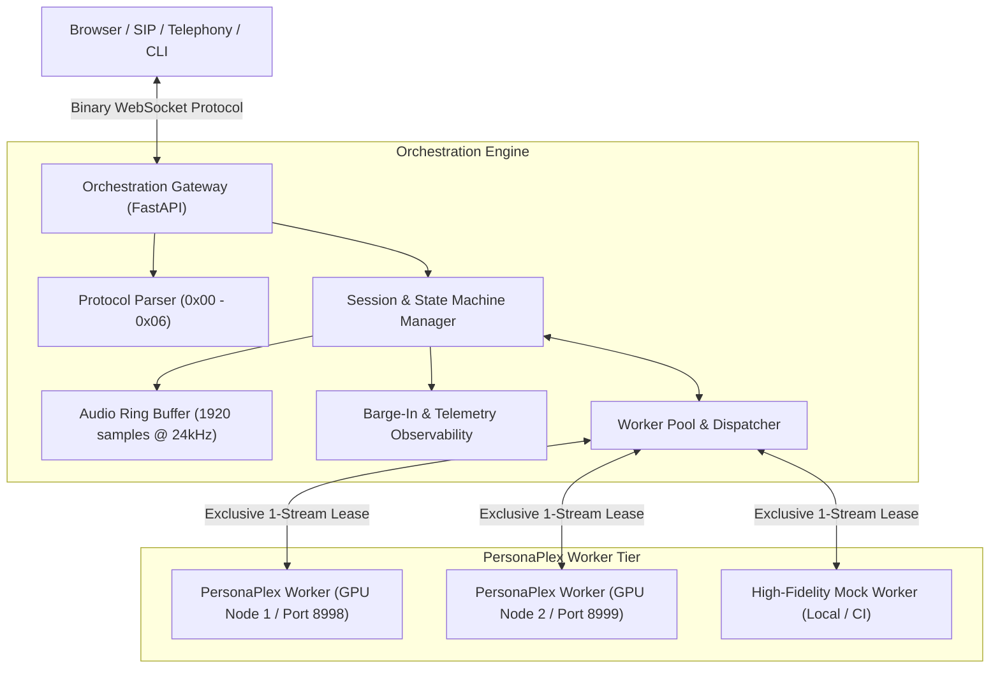

# PersonaPlex Orchestration Layer (Phase 1)

An open-source, full-duplex orchestration layer for real-time speech-to-speech voice agents powered by **NVIDIA PersonaPlex** (Moshi architecture, 24 kHz, 12.5 Hz frame rate, 1,920 samples/frame). 

100% open source: zero proprietary APIs, zero paid cloud services.

---

## Architecture Overview



---

## Technical Specifications

| Parameter | Specification | PersonaPlex Architectural Source |
|:---|:---|:---|
| **Audio Sample Rate** | `24,000 Hz` (24 kHz) | Mimi Neural Audio Codec |
| **Audio Channels** | 1 (Mono) | Single input/output channel |
| **Model Frame Cadence** | `12.5 Hz` | 80 ms step period |
| **Frame Size** | `1,920 samples` | `24,000 / 12.5 = 1,920` samples (float32 / int16) |
| **Streaming Protocol** | Binary WebSocket Framing | `0x00` Handshake, `0x01` Audio, `0x02` Text, `0x03` Control, `0x04` Metadata, `0x05` Error, `0x06` Ping |
| **Vocal Conditioning** | 18 Preset Embeddings (`.pt`) or custom `.wav` | `NATF0-3`, `NATM0-3`, `VARF0-4`, `VARM0-4` |
| **Behavioral Conditioning** | Plain Text wrapped with `<system>` tags | Delimited by `<system> {text} <system>` |
| **Stream Concurrency** | 1 Stream per Worker Process | In-memory KV-cache and delay lines enforced by worker pool |

For in-depth analysis of the official repository, weights, and model card, see [docs/personaplex-notes.md](file:///c:/Users/kisho/Desktop/orchestration_ai/docs/personaplex-notes.md).

---

## Quickstart

### 1. Installation

```bash
# Clone the repository and navigate to root
cd orchestration_ai

# Create virtual environment and install dependencies
uv venv .venv
uv pip install --python .venv/Scripts/python.exe -r requirements.txt
```

### 2. Run Gateway with Local Mock Workers (No GPU required)

```bash
# Start Gateway with 2 auto-spawned mock workers for local development
.venv/Scripts/python.exe -m orchestration.cli run-gateway --host 127.0.0.1 --port 8000 --mock-workers 2
```

Open the **Developer Console** in your browser at:
👉 **[http://127.0.0.1:8000/console](http://127.0.0.1:8000/console)**

### 3. Connect to Official PersonaPlex on NVIDIA GPU

Launch the official PersonaPlex server on your GPU node:
```bash
# On GPU machine (e.g. RTX 4090 / A100):
export HF_TOKEN=<YOUR_HUGGINGFACE_TOKEN>
python -m moshi.server --port 8998
```

Start the orchestration gateway pointing to the GPU worker:
```bash
.venv/Scripts/python.exe -m orchestration.cli run-gateway --port 8000 --worker gpu-0:127.0.0.1:8998:0
```

### 4. Run a Test Voice Call via CLI

```bash
# Send test audio through the full-duplex pipeline and capture agent response
.venv/Scripts/python.exe -m orchestration.cli test-call --persona wise_teacher --output-wav agent_reply.wav
```

---

## REST & WebSocket API Reference

| Method | Endpoint | Description |
|:---|:---|:---|
| `GET` | `/healthz` | Gateway operational health and worker pool status |
| `GET` | `/metrics` | Frame throughput, active sessions, and barge-in statistics |
| `GET` | `/v1/agents` | Catalog of configured personas and available voice presets |
| `POST`| `/v1/agents` | Register a new agent persona |
| `GET` | `/v1/workers` | Worker pool utilization and node health |
| `POST`| `/v1/workers` | Register a new worker node |
| `GET` | `/v1/sessions` | List active full-duplex sessions |
| `GET` | `/v1/sessions/history` | Historical session transcripts and performance metrics |
| `WS`  | `/v1/realtime` | Full-duplex bidirectional streaming WebSocket |

---

## Testing

Run the complete test suite:
```bash
.venv/Scripts/python.exe -m pytest -v
```

All 30 unit, integration, and end-to-end tests cover:
- Binary protocol wire framing and byte-level round-trips
- 24 kHz audio buffering, RMS calculation, and 1920-sample chunking
- Voice prompt normalization and `<system>` tag wrapping
- PersonaPlex mock server and single-session lock verification
- Worker pool leasing, release, and queue wakeup
- Barge-in / interruption state transitions
- Gateway REST routes and WebSocket streaming
- End-to-end audio file streaming and transcript generation
