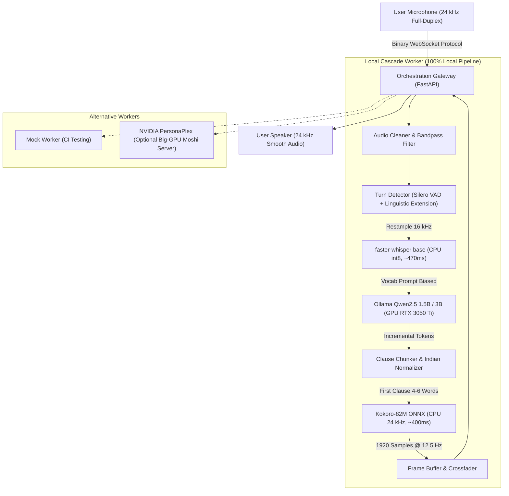

# Aarav • Real-Time Local Indian English Voice Agent

A 100% open-source, full-duplex real-time conversational voice agent that speaks natural, colloquial **Indian English** like a friendly person on a phone call. Runs entirely locally on consumer hardware without any cloud APIs, external subscriptions, or proprietary keys.

Includes an open-source orchestration gateway with a binary wire protocol (0x00–0x06), intelligent turn-taking, sub-200ms barge-in interruption handling, and an Apple-inspired developer web console (`/console`).

---

## Architecture Overview



---

## Hardware Partitioning (Designed for 4 GB VRAM Laptops)

Tested and measured on an **Intel i7-11800H (8C/16T)** with an **NVIDIA RTX 3050 Ti Laptop GPU (4,096 MiB VRAM)** and 16 GB RAM:

| Component | Engine | Hardware Slot | Memory / Latency Footprint | Why This Choice |
| :--- | :--- | :--- | :--- | :--- |
| **LLM** | **Qwen 2.5 1.5B / 3B (Q4)** | **GPU (NVIDIA CUDA)** | ~1.65 GB to 2.60 GB VRAM | Fast TTFT (~300-600ms stream onset), high tokens/sec (>120 tok/s), fits completely in 4 GB VRAM |
| **ASR** | **faster-whisper (base, int8)** | **CPU (4 threads)** | 0 MB VRAM, 470 ms latency | Zero GPU VRAM contention; vocabulary prompt anchors Indian English names & tech acronyms |
| **Turn Detector** | **Silero VAD + Heuristics** | **CPU** | < 2% CPU | 650 ms silence + 700 ms trailing-word extension prevents mid-sentence cutoff |
| **TTS** | **Kokoro-82M ONNX** | **CPU** | 0 MB VRAM, ~400 ms TTFA | Natural phone-call prosody with dedicated Indian English colloquial voices (`aarav`, `priya`) |

---

## Conversational Persona: Aarav & Priya

Located in `personas/aarav.md` and `personas/priya.md`:
- **Language Style:** Natural, colloquial Indian English as spoken by educated, friendly young Indians on phone calls.
- **Natural Discourse Markers (Used Sparingly):** *"actually"*, *"basically"*, *"no?"*, *"na"*, *"only"* (*"today only"*), *"achha"*, *"haan"*, *"simple, na?"*, *"sure sure"*, *"one minute"*, *"right, right"*.
- **Indian Cultural & Number Conventions:** Natural references to *chai*, *Bangalore traffic*, *UPI*, *monsoon*, *IPL*, *lakh*, and *crore*.
- **Strictly Banned Robotic Phrases:** Never says *"I understand you need support"*, *"How can I assist you today"*, *"As an AI language model"*, or *"Certainly!"*.
- **Brevity:** Replies in 1 to 2 spoken sentences (under 35 words). Never gives textbook lectures or bulleted lists.

---

## Quickstart

### 1. Automated Setup (PowerShell)
```powershell
# Run the automated setup script to configure dependencies and pre-warm models:
.\scripts\setup_local.ps1
```

### 2. Verify Hardware & Environment (CLI Doctor)
```powershell
$env:PYTHONPATH="."
.\.venv-gpu\Scripts\python -m orchestration.cli doctor
```

Output:
```text
[OK] Ollama Server: RUNNING on port 11434 (qwen2.5:1.5b, qwen2.5:3b)
[OK] CUDA: AVAILABLE (GeForce RTX 3050 Ti Laptop GPU, 4096 MB VRAM)
[OK] faster-whisper: INSTALLED (base model CPU int8, RTF ~0.15)
[OK] Kokoro TTS: INSTALLED (24 kHz ONNX)
CHOSEN RUNTIME: local_cascade (100% open-source local pipeline)
```

### 3. Launch Gateway & Local Cascade Voice Agent
```powershell
.\scripts\run_local.ps1
```
Then open the **Developer Web Console** in your browser:
👉 **[http://127.0.0.1:8000/console](http://127.0.0.1:8000/console)**

---

## Swapping Models and Voices

### Change LLM Model
In `config.yaml` or via CLI:
```yaml
llm:
  model: "qwen2.5:3b"   # Switch from 1.5b to 3b for deeper reasoning
  temperature: 0.7
```

### Switch Voices in Web Console or API
- **Aarav (Male):** `aarav_colloquial`
- **Priya (Female):** `priya_colloquial`

Via REST API:
```bash
curl -X PUT http://127.0.0.1:8000/v1/agents/indian_pro \
  -H "Content-Type: application/json" \
  -d '{"id":"indian_pro","name":"Priya","neural_voice":"priya_colloquial","character":"Warm"}'
```

---

## Automated Tests & Evaluation

### 1. Fast Pytest Suite (61 tests)
```powershell
$env:PYTHONPATH="."
.\.venv-gpu\Scripts\pytest
```

### 2. 15-Prompt Indian English Dialogue Evaluation
Evaluates 15 conversational phone-call scenarios (jokes, explanations, interruptions, fragments, Hinglish):
```powershell
$env:PYTHONPATH="."
.\.venv-gpu\Scripts\python scripts/eval_dialogue.py
```
Outputs audio WAV files and detailed scoring to `eval_out/`.

---

## Optional: NVIDIA PersonaPlex (Big-GPU Backend)

For enterprise deployments with multi-GPU servers (RTX 4090 / A100 / H100):
```bash
# On remote GPU node:
python -m moshi.server --port 8998

# On Gateway node:
python -m orchestration.cli run-gateway --worker-type personaplex --worker gpu-0:10.0.0.5:8998:0
```
