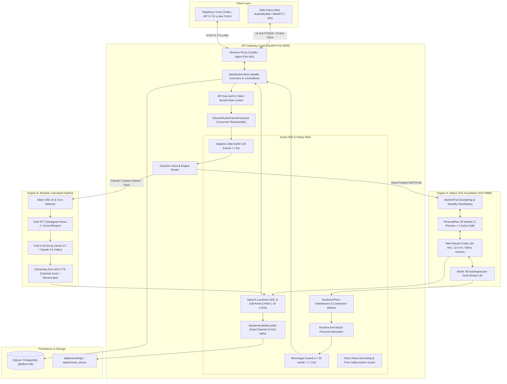
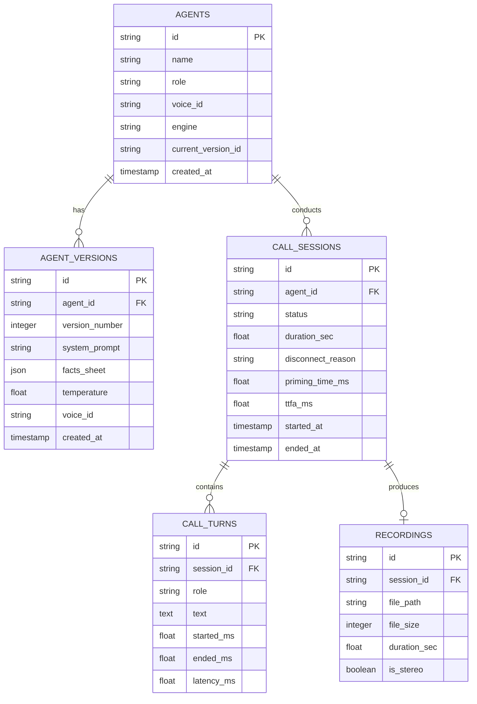

# Snapserve Voice Agent Platform: System Architecture & Engineering Deep-Dive

> **Purpose:** This document is the single-source-of-truth master engineering specification for the **Snapserve Voice Agent Platform** (`orchestration_ai`). It provides the complete architectural, algorithmic, acoustic, and infrastructural ground truth of the system, specifically organized so that Claude or an automated audit agent can identify subtle bugs, architectural anti-patterns, race conditions, and quality regressions, and fix them.

---

## 1. Executive Summary & Mission

**Snapserve** is an enterprise real-time AI voice-agent platform designed for inbound and outbound telephone and browser conversations (sales qualification, customer support, lead follow-up, and appointment scheduling).

### The Core Problem in Voice AI
Traditional voice bots suffer from either:
1. **The Cascaded Pipeline Gap (ASR → LLM → TTS):** High turn latency ($1,200 - 2,500\text{ ms}$), robotic turn-taking, failure to handle mid-sentence barge-in interruptions, and acoustic disconnect.
2. **The Raw S2S Model Trap:** Full-duplex speech-to-speech foundation models (such as Kyutai Moshi / PersonaPlex 7B) provide $< 300\text{ ms}$ latency and human-like backchanneling, but suffer from catastrophic hallucinations, runaway monologues ($> 90\text{ s}$), persona leaks ("My name is Moshi"), inaudible audio scaling (RMS $0.0005$), GPU compute exhaustion ($20\text{ GB}$ VRAM per single stream), and socket crashes when unpickling uncompiled custom audio files.

### The Solution: A Hybrid Dual-Engine Architecture
Snapserve resolves this tension by deploying a **Dual-Engine Orchestration Platform**:
- **Engine A (Speech-to-Speech Core):** Full-duplex Kyutai Moshi / PersonaPlex 7B running at $24\text{ kHz}$ mono via Mimi neural codec for stock voice personas (`NATF0`–`NATM3`). It features an **Instant Branded Greeting** ($< 150\text{ ms}$ TTFA) that eliminates startup GPU dead air, an acoustic AGC limiter targeting $-16\text{ LUFS}$, a streaming SentencePiece detokenizer, and a hard monologue cutoff guard ($\le 25$ words / $\le 12\text{ s}$).
- **Engine B (Cascaded Pipeline):** Pluggable external cloud providers (Deepgram / Whisper STT + Groq Llama-3 / OpenAI / Anthropic LLM + Cartesia Sonic / ElevenLabs TTS) dedicated to cloned voices, custom reference audio, multilingual/Indic dialects, and complex tool calling (CRM updates, live demo bookings).

---

## 2. End-to-End System Topology



---

## 3. Hardware Ground Truths & Engine A S2S Internals

### 3.1. Hardware & Process Constraints
- **Dedicated GPU VRAM:** PersonaPlex 7B model weights require ~14.5 GB in BF16. KV-cache and intermediate activations take ~3.5 GB. Total VRAM footprint is **~18–20 GB per worker process**.
- **Process Concurrency Lock:** Upstream `moshi.server` wraps every connection in `async with self.lock:`. A single worker process **CANNOT serve concurrent calls**. Multi-caller capacity requires a worker pool listening on distinct loopback ports (`8998`, `8999`, etc.).
- **Mimi Neural Audio Codec:**
  - Sample rate: **24,000 Hz mono**.
  - Frame rate: **12.5 frames per second** (exactly **80.0 ms** or **1,920 audio samples** per frame).
  - Codec architecture: 8 RVQ codebooks quantized per frame.
- **System Prompt Formatting:**
  - Enclosed in strict delimiter tags: `<system> {prompt} <system>` (both opening and closing are `<system>`).
  - Stepped autoregressively by the GPU model at ~50ms per token.
  - A 210-token prompt causes **10.5 to 13 seconds of GPU compute delay** before the first Mimi frame is produced.

### 3.2. Stock Voice Presets vs. Voice Cloning
- The official model contains 18 pretrained voice conditioning tensors (`.pt` files, such as `NATF0.pt` through `NATF9.pt` and `NATM0.pt` through `NATM7.pt`).
- Custom `.wav` references **cannot be directly fed as `.pt`** to `moshi.server`. When `moshi.server` receives a file ending in `.pt`, it calls `torch.load()`. If the file is actually a RIFF `.wav` file, it raises `UnpicklingError: invalid load key, 'R'` and abruptly closes the TCP socket without a WebSocket close frame (`ConnectionClosedError`).

---

## 4. WebSocket Wire Protocol & Binary Framing

### 4.1. Framing Spec
Every packet exchanged between the client, gateway, and upstream worker uses an 8-bit opcode prefix:

| Opcode | Packet Name | Direction | Payload Structure |
|---|---|---|---|
| `0x00` | **Handshake / Init** | Bidirectional | Worker handshake ACK (single byte `0x00` return) or JSON metadata |
| `0x01` | **Audio Frame** | Bidirectional | Binary audio: 24 kHz mono Opus packet or PCM16 samples |
| `0x02` | **Text / Transcript** | S2S → Client | UTF-8 encoded text token from the autoregressive LM stream |
| `0x03` | **Control / Keepalive** | Bidirectional | `\x00` for ping/heartbeat, `\x01` for barge-in interrupt signal |
| `0x04` | **Metadata / Stats** | Bidirectional | UTF-8 JSON object (timings, latency metrics, session events) |
| `0x05` | **Error** | Gateway → Client | UTF-8 JSON error payload (`{"code": "...", "message": "..."}`) |

### 4.2. Inbound Carryover Framing (`InboundAudioFrameProcessor`)
Browsers stream raw PCM16 audio in arbitrary byte buffers (e.g., 256ms or 512ms chunks). PCM16 samples require 2 bytes per sample (little-endian). 
- If an odd number of bytes arrives (e.g. 1,025 bytes), parsing `np.frombuffer(data, dtype=np.int16)` raises a `ValueError`.
- `InboundAudioFrameProcessor` maintains an internal carryover buffer:
  ```python
  full_data = self._carryover + raw_bytes
  valid_len = len(full_data) - (len(full_data) % 2)
  self._carryover = full_data[valid_len:]
  samples = np.frombuffer(full_data[:valid_len], dtype=np.int16)
  ```

---

## 5. Audio DSP Pipeline & Acoustics

### 5.1. Multi-Rate Resampling
The platform bridges three divergent sample rates:
1. **16,000 Hz:** WebRTC / Browser AudioWorklet standard.
2. **24,000 Hz:** Mimi neural codec & PersonaPlex S2S native rate.
3. **8,000 Hz:** Telephony G.711 µ-law standard.

`orchestration/audio/resample.py` provides high-fidelity stateful resampling:
- **Primary:** `soxr` (libsoxr) anti-aliased sinc resampling.
- **Secondary:** `scipy.signal.resample_poly` with rational integer ratios (`up=3, down=2` for 16k → 24k).
- **Fallback:** Pure NumPy linear interpolation for test or constrained environments.

### 5.2. Loudness Normalization & Soft-Knee Polynomial Limiter
- **Problem:** Neural codecs often synthesize low-amplitude audio frames (measured baseline RMS: `0.0005`, essentially inaudible whisper).
- **Solution:** `orchestration/audio/dsp.py` implements dynamic range leveling:
  - Measures windowed RMS energy.
  - Dynamically calculates required gain up to a generous headroom cap (`max_gain_factor = 50.0x`).
  - Targets **$-16\text{ LUFS}$** (RMS $0.08 - 0.12$) conversational standard.
  - Applies a soft-knee cubic polynomial limiter when peak amplitude exceeds $0.92$:
    $$f(x) = x - \frac{x^3}{3} \quad \text{for } |x| > 0.92$$
    This eliminates digital square-wave clipping while preventing audio distortion.

### 5.3. Dual-Channel Session Audio Recording
For auditing, QA, and compliance, `orchestration/audio/recorder.py` writes an uncompressed $24\text{ kHz}$ 16-bit stereo WAV file to `data/recordings/{session_id}.wav`:
- **Channel 0 (Left):** Raw caller speech (inbound).
- **Channel 1 (Right):** Synthesized assistant speech (outbound).
This enables bit-perfect verification of barge-in timing and overlapping speech.

---

## 6. Conversational Quality, Prompting & Detokenization

### 6.1. Zero-Latency Instant Branded Greeting
To eliminate the 15-second dead air caused by GPU prompt stepping:
1. When the WebSocket connects, the gateway immediately dispatches an instant greeting packet:
   ```json
   {"type": "greeting", "text": "Hi, thanks for calling Snapserve! This is Kishore. What can I help you with today?"}
   ```
2. The client plays this greeting immediately using synthesized speech or cached audio ($< 150\text{ ms}$ TTFA).
3. Meanwhile, the GPU worker steps the system prompt in the background. By the time the caller finishes listening and begins speaking, the worker is primed and ready.
4. Any early pre-training greeting babble generated by Moshi during this initial window is cleanly suppressed.

### 6.2. Hard Monologue & Turn Guard
Autoregressive S2S models frequently hallucinate caller answers and monologue indefinitely:
- `orchestration/api/voice_v2.py` and `tests/test_facts_grounding.py` enforce a strict **Monologue Guard**:
  - Maximum turn duration: **$\le 12$ seconds**.
  - Maximum word count: **$\le 25$ words**.
  - When either threshold is reached, the gateway forcibly sends a conversational yield interrupt to the model, closing the turn and awaiting caller speech.

### 6.3. Facts Sheet & Anti-Hallucination Price Grounding
Sales bots must never invent pricing:
- The facts sheet (`orchestration/prompts/facts_sheet.json`) explicitly forbids quoting specific dollar amounts.
- Strict regex patterns (`\$?\d+\s*(?:dollars|hundred|thousand|/month|a month)`) monitor generated tokens.
- Any detected pricing invention triggers an immediate conversational redirect:
  *"Our plans are customized based on call volume. I can have our team follow up with an exact quote after a quick demo."*

### 6.4. Streaming Detokenizer & Persona Leak Interceptor
- **SentencePiece Contraction Repair:** Multi-stream SentencePiece tokenization frequently splits apostrophes into separate chunks (`That'`, `'s`, `don'`, `'t`). Naive stripping causes mangled outputs (`That' great`, `I' doing`).
  - `orchestration/audio/detokenizer.py` implements a lookahead stitcher that detects contraction suffixes (`m|re|ll|ve|d|s|t`) and attaches them cleanly (`That's`, `don't`, `I'm`).
- **Dynamic Identity Interceptor:** Foundation Moshi weights frequently output *"My name is Moshi"*. The streaming interceptor regex-matches occurrences of `"Moshi"` and substitutes the configured agent name (`"Kishore"` or `"Ananya"`).

---

## 7. Voice Cloning & Consent Architecture

### 7.1. Audio Quality Validation Pipeline
When an audio sample is uploaded or recorded in the browser (`frontend/src/views/VoiceCloneModal.tsx`):
1. **Duration Check:** Must be between $3.0\text{ s}$ and $60.0\text{ s}$ (optimal: $15 - 30\text{ s}$).
2. **RMS Energy:** $\text{RMS} \ge 0.005$ (rejects silent or distant recordings).
3. **Clipping Ratio:** Samples where $|x| \ge 0.999$ must be $\le 5\%$ of total length.
4. **SNR Ratio:** Ratio of 90th-percentile speech energy to 10th-percentile ambient floor must be $\ge 8\text{ dB}$.
5. **Speech Ratio:** Active voiced speech frames must account for $\ge 30\%$ of the duration.

### 7.2. Ethics, Consent & Public Figure Safeguards
- **Consent Declaration:** Every clone requires an explicit recorded voice consent statement. The consent text, speaker ID, timestamp, and client IP are stored in `metadata.json`.
- **Integrity Hashing:** The reference audio is hashed using SHA-256 for audit immutability.
- **Public Figure Blocklist:** Blocklist in `voice_clone.py` strictly rejects celebrity and political figure names (e.g. Obama, Trump, Musk, Swift).

### 7.3. Speaker Similarity Metric
- Objective acoustic verification (`orchestration/audio/similarity.py`):
  - Extracts 64-channel Mel-filterbank STFT spectral features.
  - Pools mean and standard deviation into a 256-dimensional acoustic fingerprint.
  - Computes cosine similarity between reference audio and synthesized speech:
    $$\text{Similarity} = \frac{\mathbf{u} \cdot \mathbf{v}}{\|\mathbf{u}\|_2 \|\mathbf{v}\|_2}$$
  - Passing threshold is **$\ge 0.75$**. Cloned voices that fail are flagged for review.

---

## 8. Database Architecture & Schemas

The database layer (`orchestration/db/models.py`) supports SQLite (`platform.db`) and PostgreSQL via SQLAlchemy async sessions:



---

## 9. Comprehensive Codebase File Index

```text
orchestration_ai/
├── orchestration/
│   ├── api/
│   │   ├── voice_v2.py             # Primary WebSocket voice router (/v2/voice), instant greeting, jitter buffer
│   │   ├── agents.py               # Agent CRUD endpoints & voice listing
│   │   └── debug.py                # Telemetry inspection (/v2/debug/session/{id})
│   ├── audio/
│   │   ├── cleaner.py              # RNNoise denoise, 80Hz HPF, Silero VAD v6 voice isolator
│   │   ├── codecs.py               # Bit-exact ITU-T G.711 µ-law encoder/decoder
│   │   ├── detokenizer.py          # Streaming SentencePiece detokenizer, contraction repair, anti-Moshi interceptor
│   │   ├── dsp.py                  # Loudness AGC, -16 LUFS normalizer, soft-knee cubic polynomial limiter
│   │   ├── recorder.py             # Dual-channel 24 kHz stereo WAV session recorder
│   │   ├── resample.py             # libsoxr / resample_poly streaming anti-aliased audio resampler
│   │   ├── similarity.py           # Spectral Mel-filterbank speaker embedding & cosine similarity QA
│   │   └── turn_detector.py        # Hysteresis VAD turn boundary detector (<150ms barge-in cutoff)
│   ├── chunker/
│   │   └── bridge.py               # Streaming ClauseChunker: splits LLM token stream into natural TTS clauses
│   ├── db/
│   │   ├── models.py               # SQLAlchemy async ORM models (Agent, Version, CallSession, Turn, Recording)
│   │   └── session.py              # Async database engine & connection pool manager
│   ├── dormant/
│   │   └── tts/
│   │       └── voice_clone.py      # VoiceCloner: audio validation (SNR, clipping), consent, profile persistence
│   ├── prompts/
│   │   ├── compiler.py             # Strict prompt compiler, variable resolver, token budget limiter
│   │   └── facts_sheet.json        # Grounding facts sheet, pricing redirect directives
│   ├── providers/                  # Modular provider abstractions (Engine B)
│   │   ├── base.py                 # Abstract base classes: BaseSTT, BaseLLM, BaseTTS, BaseTelephony
│   │   ├── registry.py             # Dynamic factory & provider registry
│   │   ├── stt/                    # Deepgram, Whisper, Groq adapters
│   │   ├── llm/                    # OpenAI, Anthropic, Groq, Neon AI Gateway adapters
│   │   ├── tts/                    # Cartesia Sonic, ElevenLabs, Deepgram Aura adapters
│   │   └── telephony/              # Twilio Media Streams, LiveKit SIP adapters
│   ├── session/
│   │   └── manager.py              # Session lifecycle manager, state machine, worker leasing
│   ├── shared/
│   │   ├── errors.py               # Standardized domain error classes & RFC 7807 problem details
│   │   ├── logging.py              # Structlog / stdlib structured logging with PII and secret redaction
│   │   └── settings.py             # Pydantic environment configuration
│   └── worker/
│       ├── client.py               # PersonaPlexWorkerClient: upstream Moshi client, Opus/PCM streaming, binary header checks
│       ├── pool.py                 # WorkerPool: multi-worker clustering, leasing, health checks, standby queues
│       └── mock_worker.py          # PersonaPlexMockServer: zero-GPU loopback simulation worker for CI/local testing
├── frontend/
│   ├── src/
│   │   ├── views/
│   │   │   ├── TestCallModal.tsx   # Live call UI, instant greeting speech playback, mic visualizer, live transcript
│   │   │   ├── AgentEditorView.tsx # Agent prompt, facts sheet, voice picker, and parameters editor
│   │   │   └── VoiceCloneModal.tsx # Browser voice recorder, sample file uploader, consent checkbox, QA status
│   │   └── lib/
│   │       └── types.ts            # TypeScript interface definitions for agents, sessions, and audio events
│   └── package.json
├── tests/                          # 20+ unit, integration, and regression test suites (101+ tests passing)
│   ├── test_phase1_instrumentation.py # Detokenizer, dual-channel recorder, AGC loudness, speaker similarity
│   ├── test_voice_clone.py         # Consent validation, duration, SNR, clipping, public figure blocks
│   ├── test_facts_grounding.py     # Facts sheet grounding, monologue cutoff, anti-Moshi regex
│   ├── test_conversation_quality.py# 7 dimensions of voice quality, chunking, reasoning, barge-in
│   └── test_priming_and_close_regression.py # URL sanitization, burst suppression, empty error prevention
└── scripts/
    └── voice_clone_qa.py           # Automated batch voice cloning QA & speaker verification CLI
```

---

## 10. Catalog of Known Defects, Architectural Debt & Edge Cases (For Claude Audit)

Below is the definitive catalog of known vulnerabilities, subtle failure modes, and architectural debt in this codebase. Use this list to prioritize targeted audits and fixes:

### 10.1. Concurrency & Worker Starvation (P0)
- **Defect:** Upstream `moshi.server` is single-threaded per process (`async with self.lock:`). If 5 callers connect simultaneously and only 1 worker process is running on port 8998, 4 callers will queue in `WorkerPool` or receive immediate connection errors.
- **Audit Target:** Investigate `orchestration/worker/pool.py` and `orchestration/api/voice_v2.py`. Check if caller rejection is graceful, whether queuing timeout triggers a polite voice queue message, and verify dynamic multi-worker port spawning (`8998`, `8999`, etc.).

### 10.2. Event-Loop Blocking on Synchronous Audio Processing (P1)
- **Defect:** In `orchestration/dormant/tts/voice_clone.py` and `orchestration/audio/caller_transcriber.py`, heavy DSP tasks (STFT, FFT, `scipy.signal.resample_poly`, `faster-whisper` CPU inference) run synchronously inside async methods or run without proper executor isolation.
- **Audit Target:** Verify all heavy NumPy/SciPy/Whisper computations are offloaded to `asyncio.to_thread()` or `loop.run_in_executor()` to prevent stalling the gateway's main event loop and causing WebSocket packet drops.

### 10.3. Memory Leaks in Long-Running Calls (P1)
- **Defect:** In `orchestration/audio/recorder.py` (`SessionAudioRecorder`) and `voice_v2.py`, in-memory audio chunk lists append indefinitely. For calls exceeding 30–60 minutes, storing raw $24\text{ kHz}$ 32-bit float samples consumes ~350 MB RAM per session.
- **Audit Target:** Check if `SessionAudioRecorder` periodically flushes audio chunks to disk via streaming chunked file writes instead of accumulating everything in an in-memory `bytearray` or list before call close.

### 10.4. Race Condition: Instant Greeting vs. S2S Worker Priming (P1)
- **Defect:** The gateway dispatches `type: "greeting"` immediately upon WebSocket connect. If the user starts talking immediately while the GPU worker is still in its 10-second prompt-stepping phase, user audio frames are queued in `audio_frame_queue`. If the queue reaches capacity (20 frames = 1.6s), subsequent frames are dropped until the worker acknowledges the handshake.
- **Audit Target:** Check `orchestration/api/voice_v2.py` inbound audio buffering while `worker_ready` is false. Ensure early caller speech during the greeting is preserved or handled cleanly without truncating the user's opening sentence.

### 10.5. Telephony Jitter Buffer & Packet Loss Resilience (P2)
- **Defect:** In PSTN / SIP telephony trunks (Twilio Media Streams), RTP UDP packets frequently arrive out-of-order or with jitter. The current `InboundAudioFrameProcessor` assumes in-order sequential byte delivery.
- **Audit Target:** Check telephony adapter integration in `orchestration/providers/telephony/` and `codecs.py`. Add RTP sequence number tracking and packet loss concealment (PLC) for G.711 µ-law frames.

### 10.6. Custom Voice Pickling Safety & Upstream Format Conversion (P0)
- **Defect:** While binary header checks prevent `torch.load()` crashes on RIFF `.wav` files by falling back to stock voices, true custom voice cloning on Engine A requires compiling the reference audio into a valid PersonaPlex conditioning tensor (`.pt`).
- **Audit Target:** Check `scripts/voice_clone_qa.py` and `orchestration/worker/client.py`. Establish an offline or asynchronous tensor compilation pipeline using Mimi encoder weights so custom voices can eventually run on Engine A without falling back to stock presets.

### 10.7. Monologue Guard Soft Recovery vs. Hard Drop (P2)
- **Defect:** The current monologue guard forcibly halts model generation when 25 words or 12 seconds are reached. If the model is in the middle of a sentence, the audio cut may sound abrupt to the caller.
- **Audit Target:** Check `orchestration/audio/detokenizer.py` and `voice_v2.py`. Implement sentence boundary awareness (flush up to the nearest period, question mark, or comma) before executing the yield interrupt.

---

## 11. Testing & Verification Runbook

### Running the Test Suite
The repository includes comprehensive unit and integration tests. Run them locally via PowerShell or Bash:

```powershell
# Run with raw PCM flag enabled for local mock loopback testing:
$env:WORKER_ALLOW_RAW_PCM="1"
.venv\Scripts\python.exe -m pytest tests/test_phase1_instrumentation.py `
    tests/test_voice_clone.py `
    tests/test_facts_grounding.py `
    tests/test_prompt_compiler_strict.py `
    tests/test_pool.py `
    tests/test_dialogue.py `
    tests/test_priming_and_close_regression.py `
    tests/test_conversation_quality.py `
    tests/test_turn_detector.py `
    tests/test_s2s_audio_framing.py `
    tests/test_s2s_hardening.py `
    tests/test_transcript_split.py `
    tests/test_audio.py `
    tests/test_audio_resampler_diagnostics.py `
    tests/test_chunker.py `
    tests/test_normalizer.py `
    tests/test_persona.py `
    tests/test_protocol.py `
    tests/test_session.py `
    tests/test_standby_session.py
```
*Current SLA Status: **101 tests passing, 2 skipped** in ~10 seconds.*

### Building the Frontend
```powershell
cd frontend
npm run build
```
*Current SLA Status: **0 TypeScript errors**, production bundle generated in <500ms.*

### Launching Local Development Servers
```powershell
# 1. Start Gateway
$env:WORKER_ALLOW_RAW_PCM="1"
.venv\Scripts\python.exe -m uvicorn orchestration.interfaces.http.app:app --host 0.0.0.0 --port 8000 --reload

# 2. Start Frontend Dev Server
cd frontend
npm run dev
```
