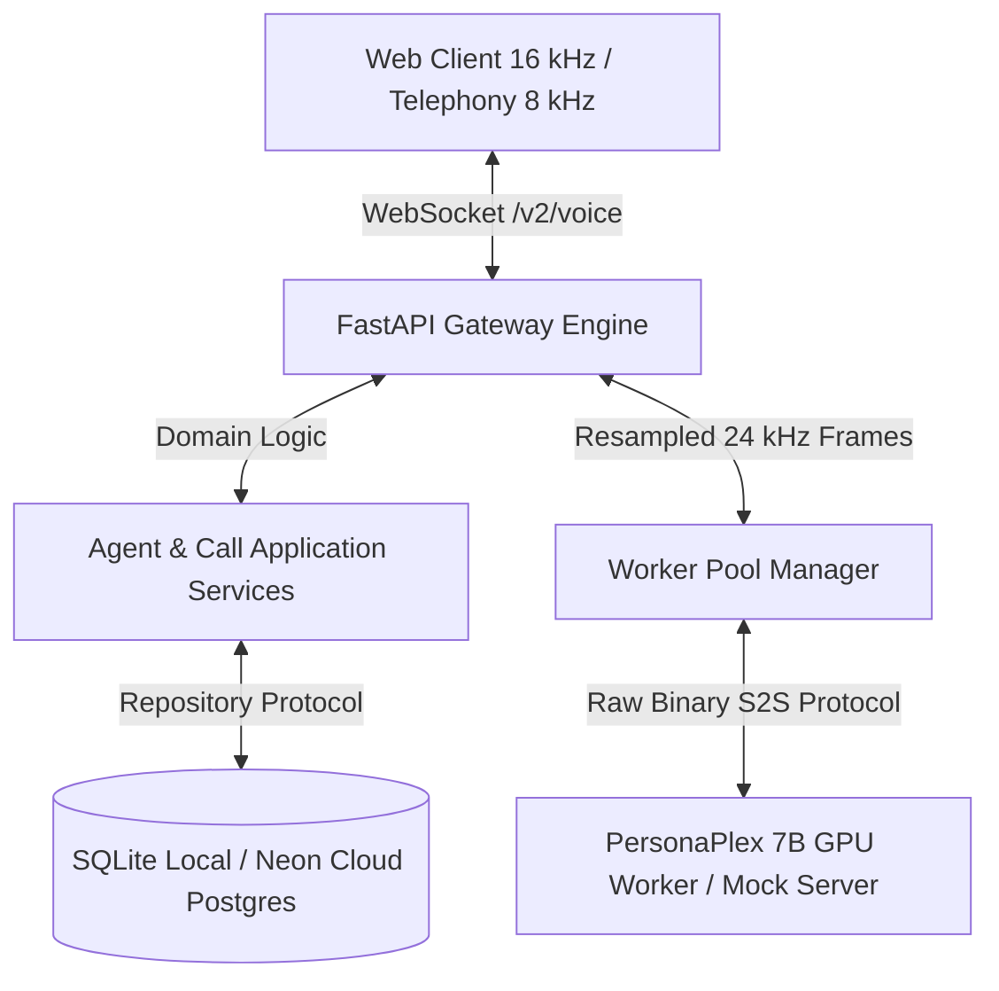
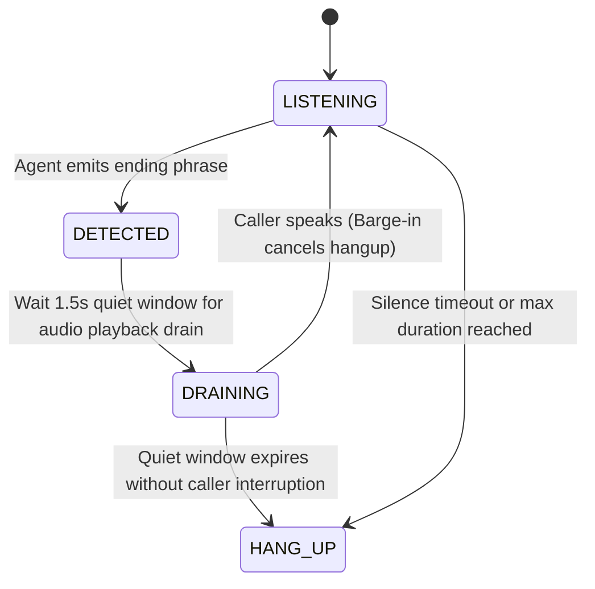

# PersonaPlex Platform Architecture Specification

> **Version:** 1.0.0 (Production Release)  
> **Aesthetic Target:** Apple Precision (HIG) + Claude Warmth & Calm  
> **Engineering Standard:** Clean Layered Architecture, Strict Mypy Typing, RFC 9457 Problem Details  

---

## 1. System Overview

PersonaPlex Voice Agent Platform is a full-duplex conversational voice AI system built for **NVIDIA PersonaPlex 7B** (speech-to-speech) and 16 kHz web / 8 kHz telephony callers.



---

## 2. Layered Clean Architecture

The codebase enforces strict boundary separation across five decoupled layers:

```
orchestration/
├── domain/                  # 1. Pure Domain Layer (Zero third-party framework dependencies)
│   ├── agent.py             # Agent aggregate, 6-field lean model, 18 official presets
│   ├── session.py           # CallSession and CallTurn entities
│   ├── prompt.py            # System prompt compilation, voice linter, timezones
│   ├── detector.py          # EndOfCallDetector state machine & quiet-window drain
│   └── protocols.py         # Abstract structural contracts (Repositories, Tokenizer, Clock)
│
├── application/             # 2. Use Cases & Orchestration Layer
│   ├── agents/              # CreateAgent, UpdateAgent, PublishVersion, RevertVersion
│   ├── calls/               # StartSession, RecordTurn, EndSession
│   └── prompts/             # PromptCompilerUseCase with token limit enforcement
│
├── infrastructure/          # 3. Adapters & External Implementations
│   ├── db/repositories/     # SQLAlchemy 2.0 async repositories (SQLite & Neon Postgres)
│   ├── clock/               # SystemClock and FrozenClock (deterministic time testing)
│   └── tokenizer/           # SentencePieceTokenizerAdapter
│
├── interfaces/              # 4. Ingress Controllers & HTTP/WebSocket Gateways
│   └── http/                # REST endpoints, Pydantic v2 DTOs, RFC 9457 error handlers
│
└── shared/                  # 5. Cross-Cutting Utilities
    ├── errors.py            # DomainError hierarchy + RFC 9457 ProblemDetail
    ├── logging.py           # Structured logging with correlation IDs & credential redaction
    ├── settings.py          # Pydantic-settings 12-factor configuration
    └── ids.py               # Type-safe prefixed ID generators (agt_, ses_, ver_, trn_)
```

---

## 3. Audio DSP & Streaming Pipeline

### 3.1 Audio Invariants
- **Web Client Standard:** 16 kHz Linear PCM 16-bit mono.
- **Model Invariant:** 24 kHz mono (Moshi Mimi dual-codebook audio tokenizer).
- **Telephony Invariant:** 8 kHz G.711 μ-law (PCMU) companded audio.

### 3.2 Polyphase Resampling
Audio conversion between client and model rates utilizes exact rational polyphase FIR filtering via `scipy.signal.resample_poly` with continuous streaming ring buffers:
- **16 kHz -> 24 kHz:** Exact upsample by 3, downsample by 2 ($L=3, M=2$). Output partitioned into exact 480-sample chunks (20ms model frames).
- **24 kHz -> 16 kHz:** Upsample by 2, downsample by 3 ($L=2, M=3$). Soft-clipped with an algebraic limiter ($y = \frac{x}{1 + |x|}$) to prevent clipping distortion before transmission to client speakers.

---

## 4. EndOfCallDetector State Machine

Graceful call termination operates through an explicit four-state lifecycle:



1. **Trigger Phrase Ingestion:** Continuous normalized string matching against the agent's configured `ending` utterance.
2. **Quiet Window (1.5s):** Prevents truncating the assistant's concluding audio output.
3. **Barge-In Invalidation:** If user speech is detected during the quiet window ($RMS > 0.012$), the termination is immediately aborted and normal conversation resumes.
4. **Finalization:** The gateway transmits a `call_ended` control packet with `reason="agent_closed"`, closes the WebSocket, releases the worker back to the pool, and persists session statistics to the database.

---

## 5. RFC 9457 Problem Details Specification

All error responses return the standard media type `application/problem+json` with unique correlation IDs:

```json
{
  "type": "https://errors.personaplex.ai/prompt-too-long",
  "title": "Prompt Exceeds Maximum Budget",
  "status": 400,
  "detail": "Compiled prompt is 382 tokens, exceeding the hard limit of 350 tokens.",
  "code": "PROMPT_TOO_LONG",
  "error_id": "err_c9f82d1e0a47",
  "timestamp": "2026-10-05T10:00:00Z"
}
```

---

## 6. Database Schema & Persistence

Built on **SQLAlchemy 2.0 Async** supporting local SQLite (`data/platform.db`) and **Neon Cloud Serverless PostgreSQL**:
- `agents`: Core agent metadata, current version pointer, mutable draft settings.
- `agent_versions`: Immutable, self-contained snapshots frozen upon publishing. Preserves exact token counts, prompt text, voice settings, and change notes.
- `call_sessions`: Telemetry records tracking total duration, TTFA latency, end reason, and client type.
- `call_turns`: Chronological spoken dialogue turns with speaker roles (`caller`, `agent`) and millisecond offsets.
