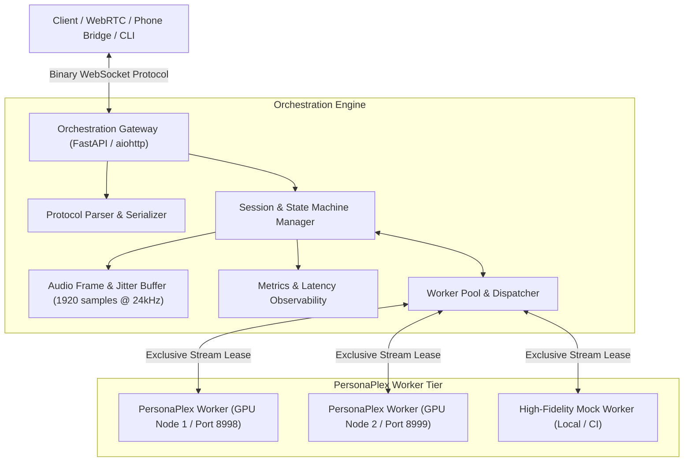

# Phase 1 Implementation Plan: Open-Source PersonaPlex Orchestration Layer

## 1. Objective
Build **Phase 1** of an open-source, full-duplex orchestration layer for real-time voice agents powered by NVIDIA PersonaPlex (Moshi architecture, 24 kHz, 12.5 Hz frame rate, 1920 samples/frame). Everything is strictly open source with zero proprietary APIs or paid services.

---

## 2. Architectural Blueprint

---

## 3. Implementation Milestones

### Milestone 1: Core Protocol, Audio Buffer, & Persona Specification
* **Deliverables:**
  * Native binary framing encoder/decoder matching PersonaPlex specification (`0x00` handshake, `0x01` audio, `0x02` text, `0x03` control, `0x04` metadata, `0x05` error, `0x06` ping).
  * Audio frame ring buffer / chunker operating at 24 kHz mono (1,920 samples = 80ms).
  * Agent Persona registry & configuration (system text prompt formatter with `<system>` tags, voice prompt registry for 18 presets: `NATF0-3`, `NATM0-3`, `VARF0-4`, `VARM0-4`).
* **Verification & Testing:**
  * Unit tests validating byte-level encoding/decoding, round-trip serialization, frame slicing, and prompt formatting.

### Milestone 2: Worker Abstraction & High-Fidelity Mock Worker
* **Deliverables:**
  * `PersonaPlexWorkerClient`: Asynchronous client that connects to upstream `python -m moshi.server` via WebSocket.
  * `PersonaPlexMockWorker`: High-fidelity standalone mock server implementing the exact PersonaPlex WebSocket protocol, frame timing (12.5 Hz / 80ms), synthetic audio synthesis, SentencePiece text token generation, and barge-in / interruption handling for development, CI, and test environments.
  * Worker health monitor, heartbeat, and status reporting (`IDLE`, `BUSY`, `UNHEALTHY`).
* **Verification & Testing:**
  * End-to-end handshake, system prompt injection, and continuous bidirectional audio stream transmission with latency verification.

### Milestone 3: Worker Pool Dispatcher & Session Management
* **Deliverables:**
  * `WorkerPool`: Dynamic worker pool managing multiple backend worker instances (handling the single-stream-per-instance hardware constraint).
  * Session State Machine: `INITIALIZING`, `CONNECTING`, `HANDSHAKING`, `STREAMING`, `INTERRUPTED`, `CLOSING`, `TERMINATED`.
  * Real-time metrics collector: frame round-trip time (RTT), jitter, audio underrun counter, generation latency, and token rate.
  * Automatic queueing or graceful rejection (`HTTP 503 / WS Error 0x05`) when all workers are saturated.
* **Verification & Testing:**
  * Concurrency tests verifying single-worker lock preservation, multi-worker dispatching, pool exhaustion handling, and worker recovery upon disconnect.

### Milestone 4: Orchestration Gateway & REST/WebSocket APIs
* **Deliverables:**
  * WebSocket endpoint `/v1/realtime`: Real-time full-duplex client endpoint with dynamic persona selection, query parameters, and bi-directional streaming.
  * REST API:
    * `GET /healthz`: Health and worker availability status.
    * `GET /v1/agents`: List configured personas and available voice presets.
    * `POST /v1/agents`: Register custom agent personas with custom voice references.
    * `GET /v1/sessions`: Active sessions list with real-time audio statistics.
    * `GET /v1/workers`: Pool status and worker health.
    * `GET /metrics`: Prometheus-compatible / JSON operational telemetry.
* **Verification & Testing:**
  * Automated API route tests, session lifecycle tests, error recovery tests.

### Milestone 5: Developer CLI & Interactive Real-Time Web Console
* **Deliverables:**
  * Developer CLI (`orchestration.cli`):
    * `run-mock-worker`: Launch mock server on desired port.
    * `run-server`: Launch orchestration gateway.
    * `test-call`: Send input `.wav` file into the gateway, capture real-time audio stream and text tokens, write output `.wav` and summary log.
  * Built-in Web UI Console (served at `/console`):
    * Clean, dark-mode dashboard showing worker cluster status, active sessions, real-time audio waveforms, and streaming transcript log.
* **Verification & Testing:**
  * End-to-end integration test running a simulated voice conversation session through the CLI and verifying generated audio duration and tokens.
